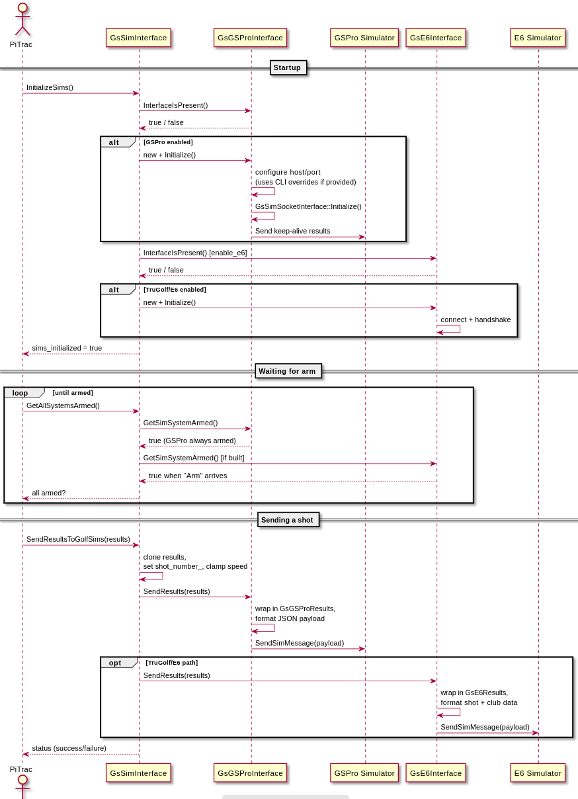
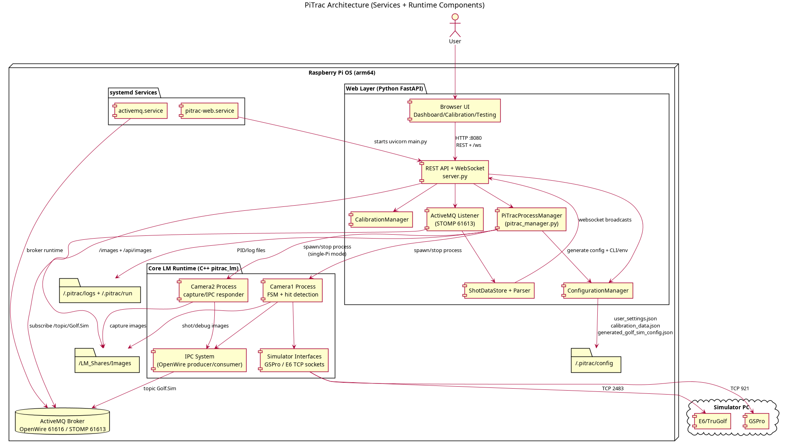
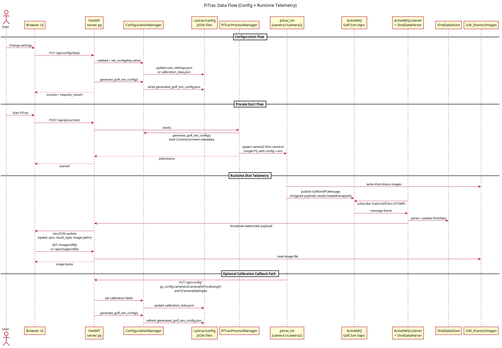
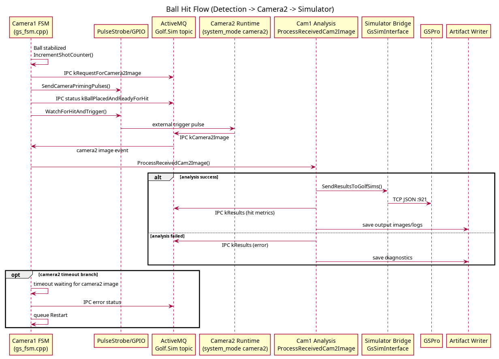
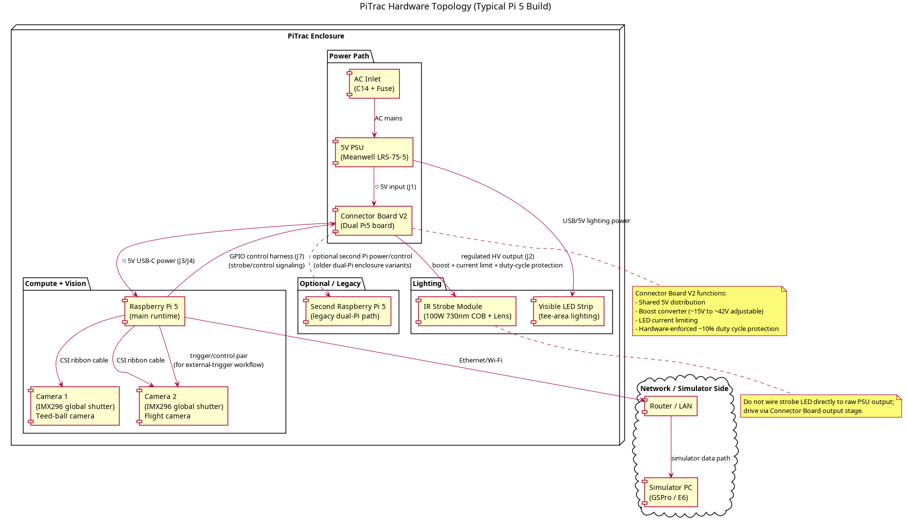
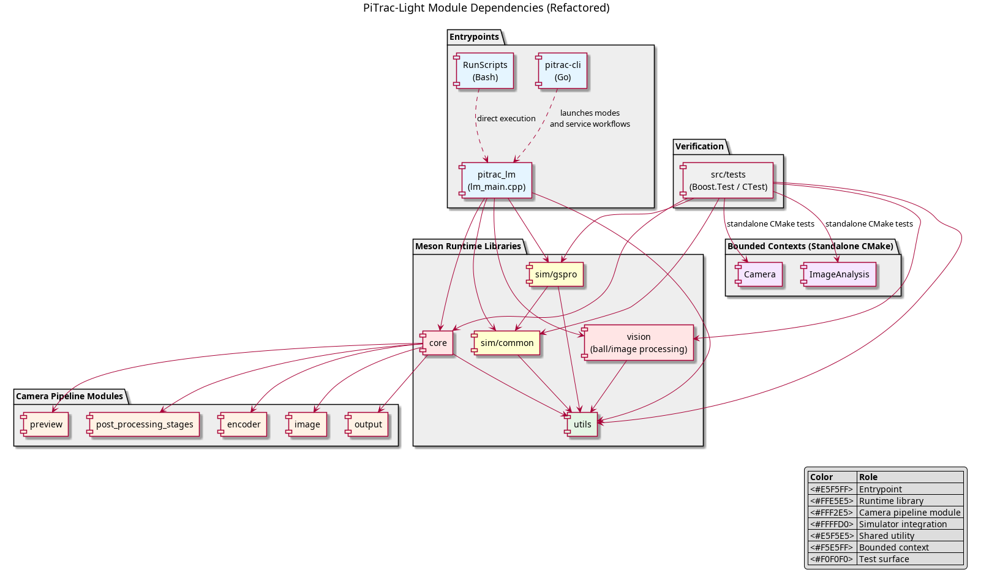
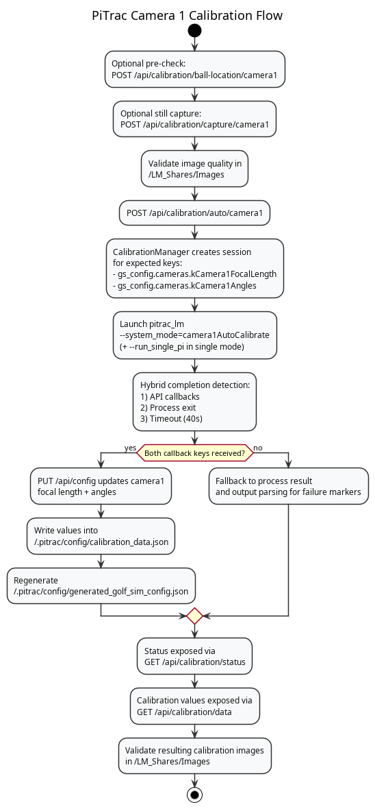
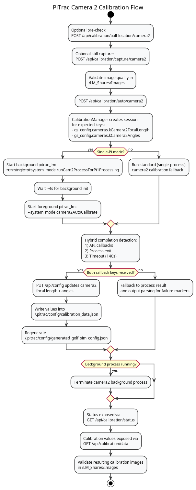

# PiTrac

Same C++ code base as https://github.com/PiTracLM/PiTrac. However, this project is meant to reduce pipelines, communications, and anything that is not needed to make shot detection, and simulators software like Open Shot Golf (OSG) and GSPro payloads slower. 


> For the hardware-focused installation and wiring guide, see the published documentation: [PiTrac Install Guide](https://pitraclm.github.io/PiTrac/software/pitrac-install.html).

## Table of Contents
- [What this is not](#what-this-is-not)
  - [CLI Installation (Raspberry Pi OS)](#cli-installation-raspberry-pi-os)
- [Repository Layout](#repository-layout)
- [Contributor Guide](#contributor-guide)
- [Pre-Requirements](#pre-requirements)
  - [CLI Installation (Raspberry Pi OS)](#cli-installation-raspberry-pi-os)
- [Getting Started](#getting-started)
  - [Step 1 — Confirm CLI Installation](#step-1--confirm-cli-installation)
  - [Step 2 — Pre-flight Check](#step-2--pre-flight-check)
  - [Step 3 — Install Dependencies](#step-3--install-dependencies)
  - [Step 4 — Environment Setup](#step-4--environment-setup)
  - [Step 5 — Configure Runtime](#step-5--configure-runtime)
  - [Step 6 — Download PiTrac-Light Release](#step-6--download-pitrac-light-release)
  - [Step 7 — Validate Everything](#step-7--validate-everything)
  - [Step 8 — Run PiTrac](#step-8--run-pitrac)
  - [Optional Developers — Install CLI from Source](#optional-developers--install-cli-from-source)
  - [Optional Developers — Build PiTrac from Source](#optional-developers--build-pitrac-from-source)
- [Meson Build Options](#meson-build-options)
- [Testing](#testing)
- [IDE Support](#ide-support)
- [Known Issues](#known-issues)
- [System Sequence Diagram](#system-sequence-diagram)
- [Architecture Diagrams](#architecture-diagrams)
  - [Runtime Architecture](#runtime-architecture)
  - [Data Flow Overview](#data-flow-overview)
  - [Ball Hit Flow](#ball-hit-flow)
  - [Hardware Topology](#hardware-topology)
  - [Module Dependencies](#module-dependencies)
  - [Calibration Flows](#calibration-flows)
- [Simulator Data](#simulator-data)
- [Licensing](#licensing)
  - [License Files](#license-files)
  - [File-Level SPDX Rules](#file-level-spdx-rules)
- [Additional Resources](#additional-resources)

## What this is not 
- Not meant to work together with existing package based PiTrac. 
- Meant to provide a source level (slower due to compiling) installation.
- Not meant to be friendly, easier to use. In fact, its harder due to self configuration, installation. 
  - However, a CLI tool pitrac-cli is included in the release 

### CLI Installation (Raspberry Pi OS)

`pitrac-cli` requires Go. On Raspberry Pi OS:

```bash
sudo apt update
sudo apt install -y golang-go unzip
go version
```

Use Go `1.21+` (the CLI module target is `go 1.21`). If `go version` prints anything below `1.21`, install a newer Go toolchain before continuing.

Download the latest `pitrac-cli_*_linux_arm64.zip` from:

[https://github.com/digitalhand/pitrac-light/releases](https://github.com/digitalhand/pitrac-light/releases)

Then install:

```bash
cd /tmp
unzip -o pitrac-cli_*_linux_arm64.zip
sudo install -m 0755 /tmp/pitrac-cli /usr/local/bin/pitrac-cli
pitrac-cli --help
```

## Repository Layout

| Path | Description |
| --- | --- |
| `src/` | Primary C++ sources (camera control, message bus, UI, pipelines). |
| `src/Camera`, `src/ImageAnalysis` | Clean-architecture bounded contexts for camera IO and tee/motion/flight analysis. |
| `src/RunScripts/` | Shell helpers for common Pi workflows (`runCam1.sh`, `runAutoCalibrateCam2.sh`, etc.). |
| `src/sim/` | Simulator integrations (`sim/common`, `sim/gspro`) that bridge PiTrac shot data into GSPro. |
| `assets/models/` | ONNX / PyTorch model files used for local inference. |
| `assets/diagram/`, `assets/images/` | PlantUML sources and rendered architecture diagrams. |
| `PiTrac.sln` | Optional Visual Studio solution for Windows developers. |

## Contributor Guide

Contributor expectations and workflow standards are documented in `AGENTS.md`.

## Pre-Requirements

This project is focused on the software/runtime side of PiTrac. It assumes your hardware setup (cameras, trigger, lighting, and wiring) is already connected and basically operational.

If hardware behavior still looks incorrect, validate software-side readiness first:

```bash
pitrac-cli doctor
pitrac-cli validate install
```

### CLI Installation (Raspberry Pi OS)

`pitrac-cli` requires Go. On Raspberry Pi OS:

```bash
sudo apt update
sudo apt install -y golang-go unzip
go version
```

Use Go `1.21+` (the CLI module target is `go 1.21`). If `go version` prints lower than `1.21`, install a newer Go toolchain before continuing.

Download the latest `pitrac-cli_*_linux_arm64.zip` from:

[https://github.com/digitalhand/pitrac-light/releases](https://github.com/digitalhand/pitrac-light/releases)

Then install:

```bash
cd /tmp
unzip -o pitrac-cli_*_linux_arm64.zip
sudo install -m 0755 pitrac-cli /usr/local/bin/pitrac-cli
pitrac-cli --help
```

## Getting Started

Follow these eight steps, in order, to go from a fresh clone to a running PiTrac system.

### Step 1 — Confirm CLI Installation

Ensure `pitrac-cli` is installed before continuing (see [CLI Installation (Raspberry Pi OS)](#cli-installation-raspberry-pi-os)).

Optional (developer build from source):

```bash
cd pitrac-cli
go build -o pitrac-cli .
sudo install -m 0755 pitrac-cli /usr/local/bin/pitrac-cli
```

### Step 2 — Pre-flight Check

Run the doctor command to verify that required tools and key files are present:

```bash
pitrac-cli doctor
```

Fix anything marked with `✗` before continuing (e.g. install `meson`, `ninja`, `cmake`, `pkg-config`, or `g++`).

### Step 3 — Install Dependencies

List available install targets and profiles:

```bash
pitrac-cli install list
```

Install everything at once:

```bash
pitrac-cli install full --yes
```

Or install one profile at a time:

```bash
pitrac-cli install base --yes        # source-deps, boost, java, msgpack-cxx
pitrac-cli install messaging --yes   # mq-broker, activemq-cpp
pitrac-cli install camera --yes      # lgpio, libcamera
pitrac-cli install compute --yes     # opencv, onnx
```

Individual targets work too:

```bash
pitrac-cli install opencv --yes
```

Use `--dry-run` to preview commands without executing.

### Step 4 — Environment Setup

Generate the env file and inject the `source` line into your shell profile:

```bash
pitrac-cli env setup --force
source ~/.bashrc
```

If you already know your final release directory, pass it explicitly:

```bash
pitrac-cli env setup --force --pitrac-root /path/to/pitrac-light
source ~/.bashrc
```

This creates `~/.pitrac/config/pitrac.env` with the following variables:

| Variable | Default |
| --- | --- |
| `PITRAC_ROOT` | Auto-detected repository root |
| `PITRAC_MSG_BROKER_FULL_ADDRESS` | `tcp://127.0.0.1:61616` |
| `PITRAC_WEBSERVER_SHARE_DIR` | `$HOME/LM_Shares/Images/` |
| `PITRAC_BASE_IMAGE_LOGGING_DIR` | `$HOME/PiTracLogs` |
| `PITRAC_WEB_SERVER_URL` | `http://localhost:8080` |

Edit the env file directly if you need to change any values, then re-source your shell.

### Step 5 — Configure Runtime

Copy the default `golf_sim_config.json` into the user config directory:

```bash
pitrac-cli config init
```

This places the config at `~/.pitrac/config/golf_sim_config.json`. Pass `--force` to overwrite an existing copy.

### Step 6 — Download PiTrac-Light Release

Download the latest `pitrac-light` release bundle from:

[https://github.com/digitalhand/pitrac-light/releases](https://github.com/digitalhand/pitrac-light/releases)

After downloading `pitrac-light_*_linux_arm64.zip`, extract it and point `PITRAC_ROOT` to the extracted folder:

```bash
mkdir -p ~/pitrac-releases
unzip -o pitrac-light_*_linux_arm64.zip -d ~/pitrac-releases
cd ~/pitrac-releases/pitrac-light_*_linux_arm64
pitrac-cli env setup --force --pitrac-root "$PWD"
source ~/.bashrc
```

### Step 7 — Validate Everything

Run all three validation checks to confirm the setup is complete:

```bash
pitrac-cli validate env          # required env vars are set and sourced
pitrac-cli validate config       # runtime config file exists and is valid
pitrac-cli validate install      # all dependencies are installed
```

Fix any failures before proceeding.

### Step 8 — Run PiTrac

**Service mode** — start the broker and both cameras as background processes:

```bash
pitrac-cli service start          # start broker + camera 1 + camera 2
pitrac-cli service status         # check what's running
pitrac-cli service stop           # stop everything
```

You can also manage components individually:

```bash
pitrac-cli service broker start   # just the ActiveMQ broker
pitrac-cli service lm start --camera 1   # just camera 1
```

**Interactive mode** — run a single `pitrac_lm` session in the foreground:

```bash
pitrac-cli run cam                  # normal camera operation
pitrac-cli run calibrate            # manual focal-length calibration
pitrac-cli run auto-calibrate       # automatic calibration
pitrac-cli run pulse-test           # strobe/shutter pulse test
pitrac-cli run still                # single still capture
pitrac-cli run ball-location        # continuous ball detection
pitrac-cli run shutdown             # shutdown all PiTrac instances
```

Use `--camera 2` for camera 2 variants, and `--dry-run` to preview the resolved command.

**Manual launch:**

```bash
src/build/pitrac_lm --system_mode camera1 --config_file src/golf_sim_config.json
```

See [pitrac-cli/README.md](pitrac-cli/README.md) for the full CLI reference.

## Meson Build Options

`src/meson_options.txt` exposes feature flags for different hardware setups:

| Option | Default | Description |
| --- | --- | --- |
| `-Denable_compile_on_pi4=true` | `false` | Legacy Pi 4 compiler workarounds (not officially supported). |
| `-Denable_recompile_closed_source=true` | `false` | Only for PiTrac admins—rebuilds the proprietary object files. |
| `-Denable_libav=false` | `true` | Disable libav encoders if the FFmpeg stack is not available. |
| `-Denable_drm`, `-Denable_egl`, `-enable_qt` | `true` | Control preview UI backends. |
| `-Denable_opencv` | `true` | Toggle OpenCV-based post-processing (set `false` for minimal builds). |
| `-Denable_tflite` | `false` | Enable TensorFlow Lite analyzers. |
| `-Dneon_flags=arm64|armv8-neon|auto` | `auto` | Override NEON tuning for different Pi generations. |

Pass options during `meson setup`, for example:

```bash
meson setup build --buildtype=release --prefix=/opt/pitrac 
```

## Testing

PiTrac uses **Boost.Test** framework with comprehensive test infrastructure covering unit, integration, and approval tests.

### Quick Start

```bash
# Build with tests
cd src
meson setup build --buildtype=release
ninja -C build

# Run all tests
meson test -C build --print-errorlogs

# Run specific test suites
meson test -C build --suite unit          # Unit tests only
meson test -C build --suite integration   # Integration tests
meson test -C build --suite approval      # Approval/regression tests
```

### Test Organization

| Directory | Purpose | Framework |
|-----------|---------|-----------|
| `src/tests/unit/` | Fast, isolated unit tests | Boost.Test + Meson |
| `src/tests/integration/` | Multi-module integration tests | Boost.Test + Meson |
| `src/tests/approval/` | Regression tests with golden baselines | Boost.Test + Custom |
| `src/Camera/tests/` | Camera bounded context tests | Boost.Test + CMake |
| `src/ImageAnalysis/tests/` | Image analysis bounded context tests | Boost.Test + CMake |

### Running Bounded Context Tests

**Camera Module:**
```bash
cmake -S src/Camera -B src/Camera/build
cmake --build src/Camera/build
ctest --test-dir src/Camera/build --output-on-failure
```

**ImageAnalysis Module:**
```bash
cmake -S src/ImageAnalysis -B src/ImageAnalysis/build \
    -DOPENCV_DIR=/path/to/opencv -DBOOST_ROOT=/path/to/boost
cmake --build src/ImageAnalysis/build
ctest --test-dir src/ImageAnalysis/build --output-on-failure
```

### Coverage Reporting

```bash
# Enable coverage
meson configure src/build -Db_coverage=true
meson compile -C src/build

# Run tests
meson test -C src/build

# Generate HTML report
ninja -C src/build coverage-html
firefox src/build/meson-logs/coveragereport/index.html
```

### Pre-Commit Testing

Install the pre-commit hook to run tests before each commit:

```bash
# Install hook
cp hooks/pre-commit .git/hooks/pre-commit
chmod +x .git/hooks/pre-commit

# Or manually run
./hooks/pre-commit
```

### Approval Testing

Approval tests capture "golden" reference outputs. When algorithm behavior changes:

1. Run tests: `meson test -C src/build --suite approval`
2. Review differences in `test_data/approval_artifacts/`
3. If changes are intentional, copy `.received.*` → `.approved.*`
4. Commit updated baselines with explanation

**⚠️ Never update baselines without careful review!**

### Documentation

- **Test Infrastructure:** [`src/tests/README.md`](src/tests/README.md) - Comprehensive testing guide
- **Build System:** [`BUILD_SYSTEM.md`](BUILD_SYSTEM.md) - Build and test workflows
- **Test Utilities:** [`src/tests/test_utilities.hpp`](src/tests/test_utilities.hpp) - Shared fixtures and helpers

### CI/CD Integration

Tests run automatically on:
- ✅ Pre-commit (via git hook)
- ✅ Pull requests (GitHub Actions)
- ✅ Main branch commits (GitHub Actions)

See [`.github/workflows/ci.yml`](.github/workflows/ci.yml) for CI configuration.

### Coverage Goals

| Phase | Target | Status |
|-------|--------|--------|
| Phase 2 (Current) | 25% | 🟡 In Progress |
| Phase 4 (Future) | 45% | ⏳ Planned |

### Known Testing Limitations

- Legacy `src/Testing/` directory contains older golden images and CSVs - being migrated to approval test framework
- Main build tests are new (Phase 2) - coverage increasing incrementally
- Some critical paths (ball detection, FSM) need more test coverage - see [CONFIG_MIGRATION_AUDIT.md](CONFIG_MIGRATION_AUDIT.md)

## IDE Support

- **VS Code** – The repository ships with `.vscode` tasks, launch configurations, and IntelliSense settings. See `docs/VSCodeSetup.md` for screenshots and workflows.
- **Visual Studio** – Open `PiTrac.sln` to build on Windows using MSVC. Remember to keep Meson/Ninja as the reference build for Raspberry Pi deployments.

## Known Issues

- **ONNX Runtime Eigen hash mismatch** – The upstream `onnxruntime-1.17.3` source bundles Eigen via `cmake/external/eigen.cmake`, but the published hash no longer matches the live tarball. When the `pitrac-cli install` command or a manual build run `cmake`, the fetch step fails with a message similar to `HASH mismatch for file: eigen-...`. To work around this, edit `~/src/onnxruntime-1.17.3/cmake/external/eigen.cmake` (or wherever you unpacked the sources) and update the `URL_HASH` line to `SHA1=32b145f525a8308d7ab1c09388b2e288312d8eba`, then re-run the build. Track the upstream ONNX Runtime issue for a permanent fix.

## System Sequence Diagram

High-level lifecycle from startup through shot processing:



## Architecture Diagrams

### Runtime Architecture

Current refactored runtime view:



### Data Flow Overview

Configuration, runtime IPC, simulator send path, and artifact writes:



### Ball Hit Flow

Camera1 detection to camera2 capture to simulator output:



### Hardware Topology

Single-Pi primary hardware topology with optional legacy dual-Pi support:



### Module Dependencies

Current module dependency map for runtime libraries and entrypoints:



### Calibration Flows

Auto-calibration process for each camera:





## Simulator Data

- Runtime shot results are emitted through the ActiveMQ topic `Golf.Sim`.
- GSPro integration uses `sim/common` and `sim/gspro` with TCP output to GSPro (default port `921`).
- Result/debug images are written to the configured web share and logging directories (for example `~/LM_Shares/Images` and `~/PiTracLogs`).

## Licensing

This repository is mixed-license and uses file-level SPDX identifiers.

### License Files

- MIT: [`LICENSE`](LICENSE)
- GPL-2.0-only: [`LICENSES/GPL-2.0-only.txt`](LICENSES/GPL-2.0-only.txt)
- BSD-2-Clause: [`LICENSES/BSD-2-Clause.txt`](LICENSES/BSD-2-Clause.txt)
- Repository notice: [`NOTICE`](NOTICE)

### File-Level SPDX Rules

- The SPDX header on each file is the source of truth for that file's license.
- Preserve upstream/third-party notices in derived files.
- Net-new Digital Hand code should use MIT headers.
- Contributor policy: [`LICENSE_POLICY.md`](LICENSE_POLICY.md)
- Header templates: [`COPYRIGHT_HEADERS.md`](COPYRIGHT_HEADERS.md)

## Additional Resources

- Build internals: [`BUILD_SYSTEM.md`](BUILD_SYSTEM.md)
- Developer workflows: [`DEVELOPER_QUICKSTART.md`](DEVELOPER_QUICKSTART.md)
- Hook setup: [`hooks/README.md`](hooks/README.md)
- Diagram sources: `assets/diagram/*.puml`
